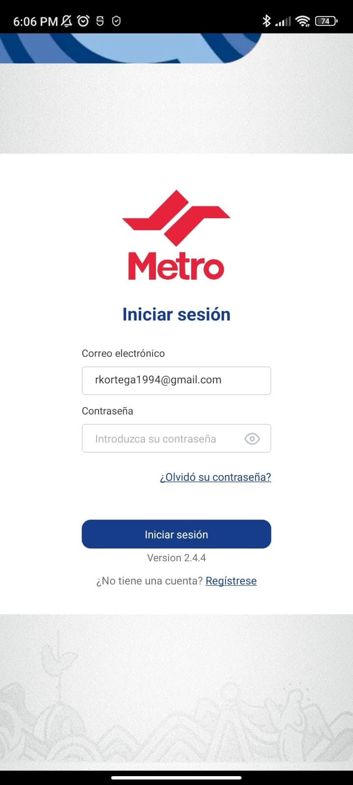
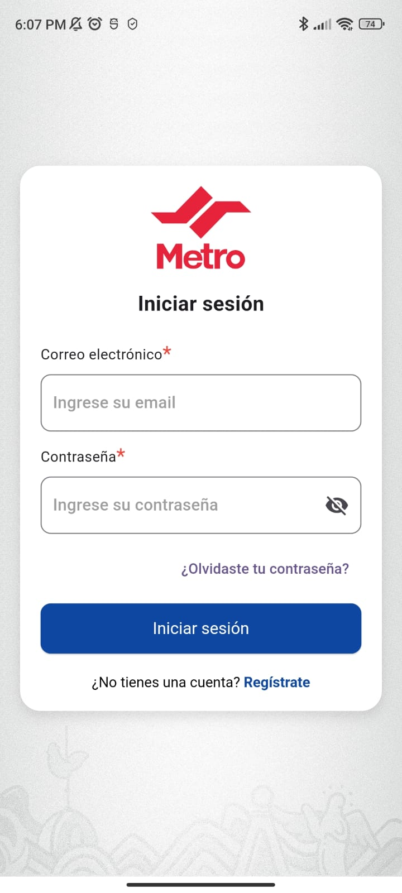
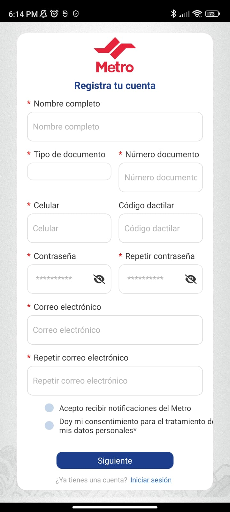
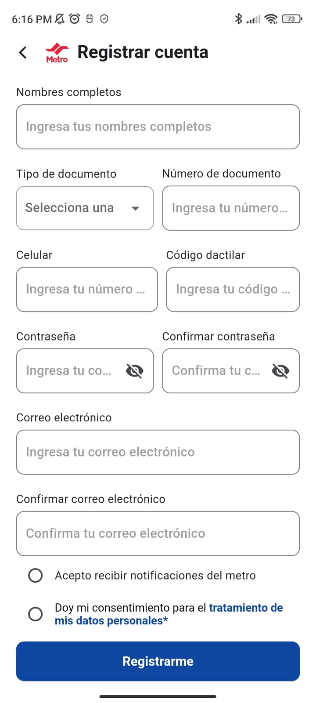
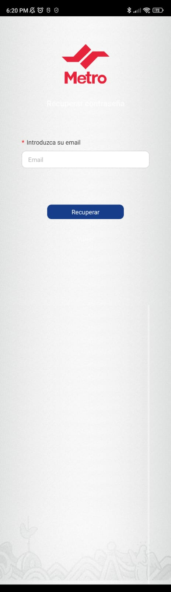
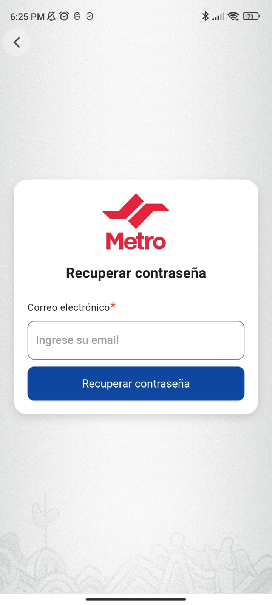
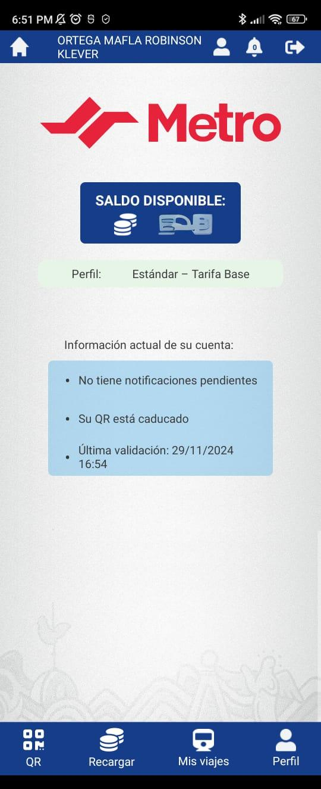
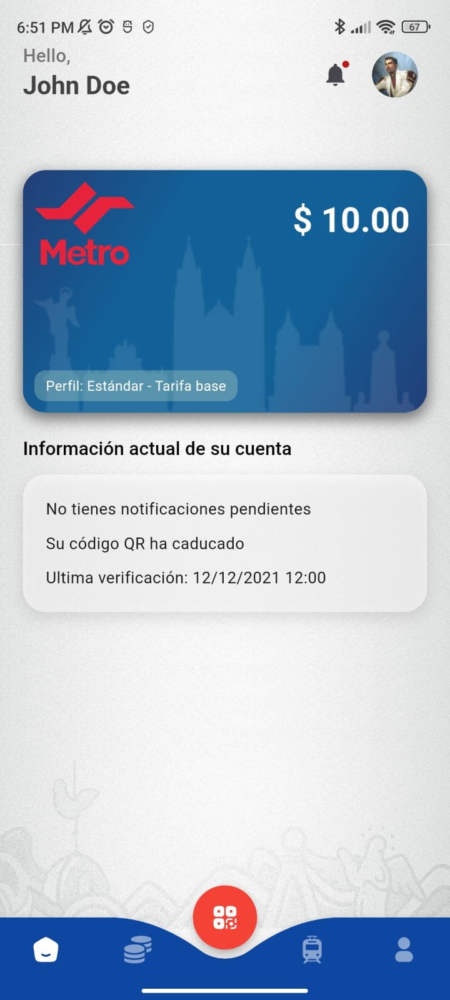

# Metro UIO - Metro de Quito - Concept design with flutter

This is a proposal for the UI/UX design of the Metro de Quito application.

**This isn't an official project**, and it's not related to the Metro de Quito company.

I don't have all the assets from the original, but I tried to make it as similar as possible.

## Screens comparison

### Login
| Original                                        | Proposal                                        |
| ----------------------------------------------- | ----------------------------------------------- |
|  |  |

### Register

| Original                                              | Proposal                                              |
| ----------------------------------------------------- | ----------------------------------------------------- |
|  |  |

### Forgot password

Here I have found a unnecessary scroll on view. 🫤

Wait... Where the f*ck is the back button? 🤔

| Original                                                   | Proposal                                                   |
| ---------------------------------------------------------- | ---------------------------------------------------------- |
|  |  |

### Home

Here's a unnecessary scroll too.

| Original                                      | Proposal                                      |
| --------------------------------------------- | --------------------------------------------- |
|  |  |
****